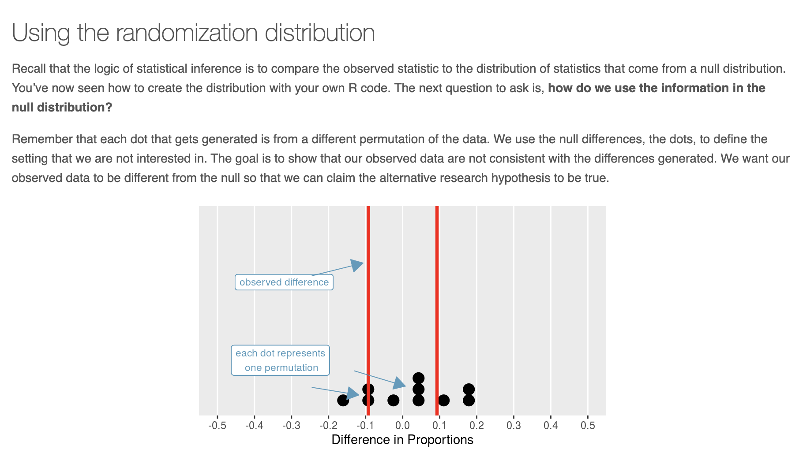
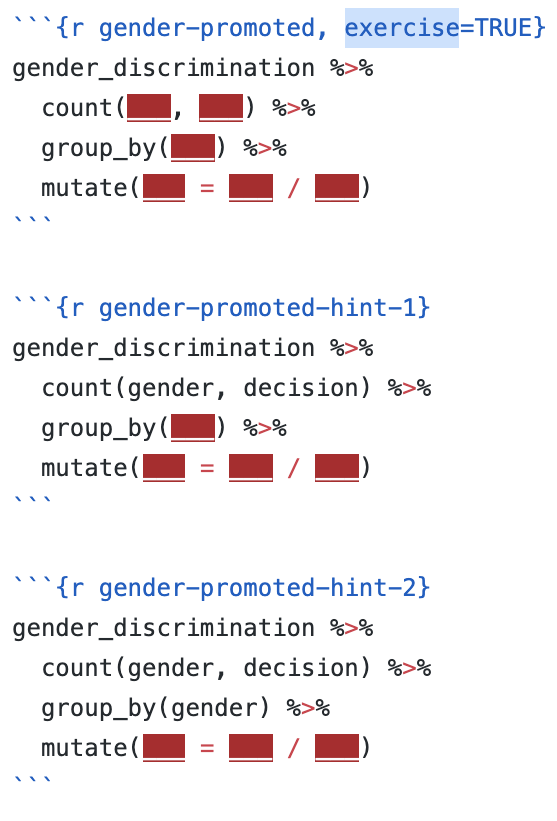

```{r, child = "setup.Rmd"}
```


```{r set-theme, include=FALSE}
library(xaringanthemer)
library(xaringan)
library(showtext)
library(fontawesome)

style_duo_accent(
  primary_color      = "#b76352", # mango
  secondary_color    = "#34605f", # bayberry
  header_font_google = google_font("Raleway"),
  text_font_google   = google_font("Raleway", "300", "300i"),
  code_font_google   = google_font("Source Code Pro"),
  header_color = "#793540", #rhubarb
  white_color = "#F5F5F5", # lightest color
  black_color = "#36454F", # darkest color
  text_font_size = "30px", 
  link_color = "#a17b76" #pink
)
```

.huge[you...]

.large[
- know R
- are familiar with R Markdown
- are interested in integrating R into your course(s)
]

---

class: middle, inverse

.pull-left[
  .huge[Tools]
]
.pull-right[
.large[
1. RStudio Cloud
2. learnr Tutorials]
]

---

class:center


.footnote[
.small[
__*__ Çetinkaya-Rundel, Mine. "Teaching R online with RStudio Cloud." [RStudio Webinar](https://rstudio.com/resources/webinars/teaching-r-online-with-rstudio-cloud/). 
]
]

---

class: center

.larger[What is RStudio Cloud?]

.pull-left-narrow[
```{r echo=FALSE}
knitr::include_graphics("images/cloud.png")
```
]

.pull-right-wide[
.large[We created [**RStudio Cloud**](https://rstudio.cloud/) to make it easy for professionals, hobbyists, trainers, teachers, and students to do, share, teach, and learn data science using R.]
]

---

background-image: url(images/rstudio-annotated.jpeg)
background-position: center
background-repeat: no-repeat
background-size: 800px
class: middle

---

background-image: url(images/cloud-annotated.jpeg)
background-position: center
background-repeat: no-repeat
background-size: 800px
class: middle

---
class: center

## Projects

.pull-left[
</br>
A new project in RStudio Cloud
```{r echo=FALSE, out.width="120%", fig.align="center"}

```
]

.pull-right[
</br>
is a new project in RStudio IDE
```{r echo=FALSE, out.width="90%", fig.align="center"}

```
]

.alert[
**PSA:** If you use RStudio, use projects! Trust me, you won’t regret it.
]

---

<center>

.larger[.rhubarb[Workspaces]]

</center>

<!-- - When you create an account on RStudio Cloud you get a workspace of your own -->

<!-- - You can add a new workspace and control its permissions -->

<!-- - Projects in either workspace can be public or private -->

```{r echo=FALSE, out.width="80%", fig.align="center"}

```

---

class: middle, center, inverse

.larger[.mango[Sharing Options]]

</br> 

--

.bitlarger[.pink[Option 1: Share a single project]]

--

.bitlarger[.gray[Option 2: Share a workspace (presumably with many projects)]]

---

<center>

.larger[.pink[Sharing a Single Project]]

</center>

</br>

.pull-left[
### Good!

- Students land directly in a project upon login
- Works well for workshops where all work will be completed in a single project
- Also great for sharing code in general, e.g. collaboration, reprexes, etc.
]

--

.pull-right[
### Not so good...

- Students need to remember to make a copy of the project (which means you need to remember to remind them!)
- You can't keep track which students started their assignment
- You can't easily peek into student projects -- they would need to explicitly share the project with you
]

---

<center>

.larger[.gray[Sharing a Workspace]]

</center>

</br>

.pull-left[

### Good!

- Base projects with desired packages installed
- Assignments -- no more "make a copy of the project before starting work"
- Collaborate with students *inside* their projects
]

--

.pull-right[
### Not so good...

- Students land in the workspace, may need to provide instructions for the next steps
- Git config for each project can get tedious and doesn't reflect realistic practice
]

---

.large[
.hand[Q: How do I access RStudio Cloud?]
]


---

class:center, middle

.huge[`learnr` Tutorials]

---

## `r emo::ji("package")` learnr

- **learnr** is an R package that makes it easy to create interactive tutorials
from R Markdown documents.

- Tutorials can include:
  - Narrative, figures, illustrations, and equations
  - Code exercises (R code chunks that users can edit and execute directly)
  - Multiple choice questions
  - Videos (YouTube, Vimeo)
  - Interactive Shiny components

- learnr is on CRAN

```{r eval = FALSE}
install.packages("learnr")
```

---

background-image: url(images/learnr.png)
background-position: center
background-repeat: no-repeat
background-size: 1000px
class: middle

---

.huge[demo] .bitarger[https://rstudio.github.io/learnr/articles/examples.html]

.large[
[**`[tutorial]`**](https://learnr-examples.shinyapps.io/ex-data-filter/)

[**`[code]`**](https://github.com/rstudio/learnr/blob/main/inst/tutorials/ex-data-filter/ex-data-filter.Rmd)
]

---

class:center

</br>

.larger[Components of a `learnr` tutorial]


---

## YAML

Start with a YAML, just like in R Markdown:

```{r eval=FALSE}
---
title: "Starting with Data"
output: 
  learnr::tutorial:
    progressive: true
    allow_skip: true
runtime: shiny_prerendered
---
```

1. Create a new RMarkdown file
2. Select from Template
3. Choose the Interactive Tutorial template from `learnr`
4. Start editing! 

---

## Narrative

- R Markdown style section and subsection headings with `##`, `###`, etc.
- Text, figures, illustrations, and equations.
- Videos: supported services include YouTube and Vimeo

```{r echo=FALSE, out.height = "75%", fig.align = "center"}

```

---

## Multiple choice questions

```{r eval=FALSE}
quiz(
  question("What position is the letter A in the english alphabet?",
    answer("8"),
    answer("14"),
    answer("1", correct = TRUE),
    answer("23"),
    incorrect = "See [here](https://en.wikipedia.org/wiki/English_alphabet) and try again.",
    allow_retry = TRUE
  ),

  question("Where are you right now? (select ALL that apply)",
    answer("Planet Earth", correct = TRUE),
    answer("Pluto"),
    answer("At a computing device", correct = TRUE),
    answer("In the Milky Way", correct = TRUE),
    incorrect = paste0("Incorrect. You're on Earth, ",
                       "in the Milky Way, at a computer.")
  )
)
```

---

## Code exercises - rendered

</br>
</br> 

```{r echo=FALSE, out.width="120%", out.height = "120%", fig.align="center"}
knitr::include_graphics("images/code-chunk-highlighted.jpg")
```

---

## Code exercises - code

```{r echo=FALSE, out.width = "30%", fig.align="center"}

```

---

## Code exercises - solution

```{r echo=FALSE, out.width="80%", fig.align="center"}
knitr::include_graphics("images/learnr-solution.jpg")
```

---

.large[
.hand[Q: How do I share with my students?]
]

- Deploy on
  - shinyapps.io (variety of pricing plans available)
  - RStudio Connect (free for academic use, requires setup)

- Essential reading:

  - [Publishing learnr Tutorials on shinyapps.io](https://cran.r-project.org/web/packages/learnr/vignettes/shinyapps-publishing.html) by Angela Li
  - [Teach R with learnr: a powerful tool for remote teaching](https://education.rstudio.com/blog/2020/05/learnr-for-remote/) by Allison Horst
  - See the [publishing instructions](https://rstudio.github.io/learnr/publishing.html) on the learnr website for step-by-step instructions

---

class: middle, inverse

.huge[Questions to Ponder]

---

class: middle

# What are my resources?

* Does your university have server time for hosting `learnr` tutorials?

--

* If not, does your university have funding sources to host these things elsewhere?  (e.g. shinyapps.io)

--

* Can you acquire funding for RStudio Cloud?  Can you charge students to use it?

--

* How much do **you** enjoy creating / teaching with R resources?

---

class: middle

# What are my learning objectives?

* If **learning R** is one of them... 

...students should probably have a native install!

--

* If **understanding how statisticians use code** is one of them ...

... consider `learnr` tutorials with pre-supplied code or pre-made RS Cloud.

--

* If **software is not a learning objective**...

... consider using R as a back-end only, to make your own life easier.
