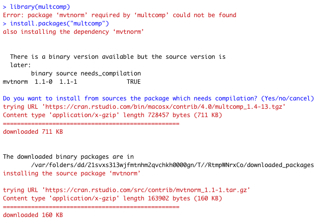
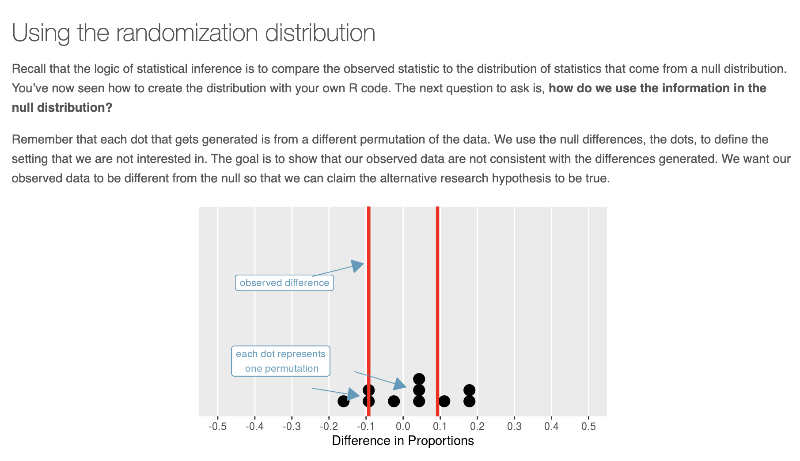
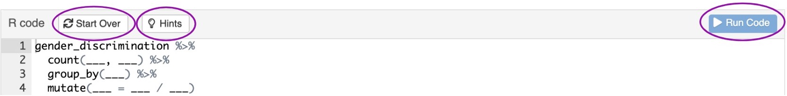
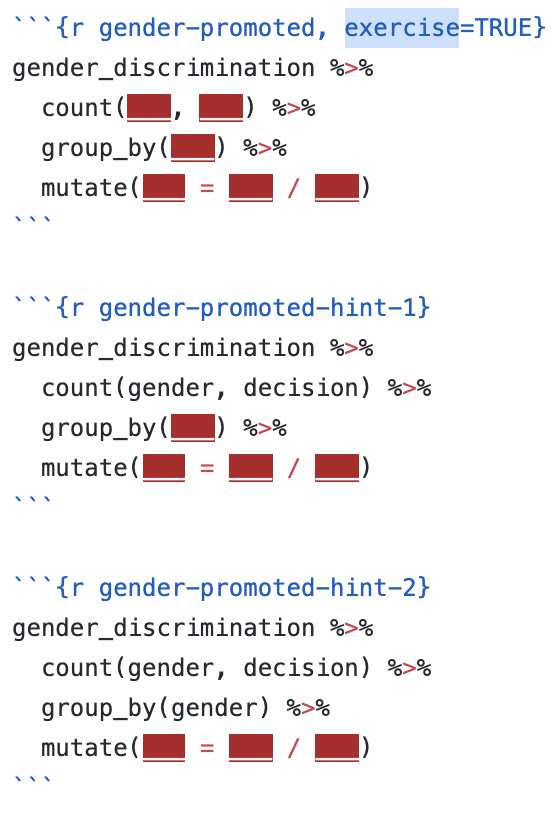
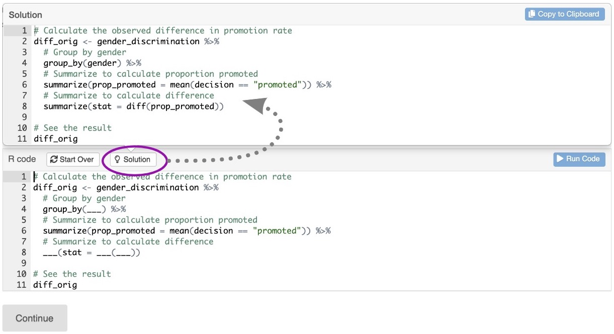

```{r, child = "setup.Rmd"}
```


```{r set-theme, include=FALSE}
library(xaringanthemer)
style_duo_accent(
  primary_color      = "#0F4C81", # pantone classic blue
  secondary_color    = "#B6CADA", # pantone baby blue
  header_font_google = google_font("Raleway"),
  text_font_google   = google_font("Raleway", "300", "300i"),
  code_font_google   = google_font("Source Code Pro"),
  text_font_size     = "30px"
)
```


```{r load-packages, message=FALSE, echo=FALSE}
library(tidyverse)
library(broom)
library(openintro)
library(palmerpenguins)
```

.huge-text[you...]

.large[
- know R
- are familiar with R Markdown
- are interested in integrating R into your course(s)
]

---

class: middle, inverse

.pull-left[
  .huge-text[Tools]
]
.pull-right[
.large[
1. At-home Install
2. RStudio Cloud
3. Shiny Apps
4. learnr Tutorials]
]

---

class:center, inverse

.huge-text[At-home Installs]

---

class: middle

.pull-left[.bitlarger[Cautionary Tale 1:] 
]

.pull-right[
  .large[
Old versions of Mac]
]

* Most of what you want to teach will work with older versions of R...

--

* ... but earlier than **R 3.4** is a problem.

--

* **Solution**:  Have students on old machines use RS Cloud.

---

class: middle

.pull-left[.bitlarger[Cautionary Tale 2:] 
]

.pull-right[
  .large[
Installing on any Mac]
]


```{r echo=FALSE, out.width = "75%", fig.align = "center"}
knitr::include_graphics("images/maxresdefault.jpg")
```

---

class: middle

.pull-left[.bitlarger[Cautionary Tale 3:] 
]

.pull-right[
  .large[
All the package headaches]
]

<center> 


---

class: middle

.pull-left[.bitlarger[Cautionary Tale 3:] 
]

.pull-right[
  .large[
  Continued...]
]

Do you want to install from sources the package which needs compilation?

--

Do you want to install from **developer version** sources **as opposed to CRAN version** the package which needs compilation?

--

<center> 


---

class: middle

.pull-left[.bitlarger[Cautionary Tale 3:] 
]

.pull-right[
  .large[
Continued...]
]

```{r, eval = FALSE}
Error in loadNamespace(name) : there is no package called 'here'
```

or

```{r, eval = FALSE}
Error in library(here) : there is no package called 'here'
```
--

* This means that a dependency didn't auto-install like it should have.

--

* Why?  

--

* No idea.  Just install the package directly

```{r, eval = FALSE}
install.packages("here")
```

---

class: middle

.pull-left[.bitlarger[Cautionary Tale 3:] 
]

.pull-right[
  .large[
Continued...]
]

```{r, eval = FALSE}
Error: package or namespace load failed for 'tidyverse' in loadNamespace(j <-
i[[1L]], c(lib.loc, .libPaths()), versionCheck = vI[[j]]): namespace 'tibble' 
2.1.3 is already loaded, but >= 3.0.0 is required
```

--

This means you're trying to update a package that's in use!

--

Clear out the **environment**, including "hidden objects"

Close other R/RStudio windows.

Try to install again.

---

class: middle

.pull-left[.bitlarger[Cautionary Tale 4:] 
]

.pull-right[
  .large[
Gen Z doesn't understand folders]
]

Things I have seen students do...

--

* Download a dataset to a random folder, expect it to be read into R automatically.

--

* Never **save** or **knit** their R Markdown file.  Lose everything when something crashes.

--

* Re-download the lab every time they want to work on it, open it from their downloads folder, copy paste code from a Google Doc.

--

* Re-download R or RStudio every time they want to open it.

---

class: middle

.pull-left[.bitlarger[Cautionary Tale 5:] 
]

.pull-right[
  .large[
Equality of assessment]
]


* Using a Studio computer means students taking exams out of their comfort zone...

--

* ... but troubleshooting individual laptops during an exam is impossible!

--

* Not all students can afford the most powerful computer.

--

* Not all students have a laptop computer they can bring to class.


---

class:center, inverse

.huge-text[
.rstudio-blue[RStudio Cloud]
]

<!-- Add RStudio blue to font families -->

---

.pull-left[

.large[**Lots of Friction**]

- Install R
- Install RStudio
- Install the following packages:
  - rmarkdown
  - tidyverse 
  - ...
- Load these packages
- Install git
- Install MiKteX
]

--

.pull-right[
.large[**Less Friction**]

- Go to rstudio.cloud
- Log in

```{r hello-r, eval=FALSE}
>hello R!
```
]

---

class:center, inverse

.huge-text[`Shiny` Apps]


---

.pull-left[
.larger[demo:]
]

.pull-right[
.small[
</br>
</br>
</br> 
https://kbodwin.shinyapps.io/Lab_Exercise_CatVars2]
]


```{r echo=FALSE, out.width = "70%", fig.align = "center"}
knitr::include_graphics("images/app_example.png")
```

---

.pull-left[
.large[**Pros**]


* Students get experience with code without typing code

* Gives them an easy "copy-paste" resource

* No need to install or interact with R/RStudio

]

--

.pull-right[
.large[**Cons**]

* Apps need to be hosted somewhere

* Many students using app at once = high computing demand

* Hard to create (for now)

]

---

class: center

</br>
</br>

.pull-left[
.larger[Solutions:]
]

.pull-right[
.larger[`shindig`]
] 

---

.center[
.larger[`shindig`]
]


* R package to create your own exercises

--

*  Distribute exercises to students in package form

*  More info: https://rstudio.github.io/learnr/publishing.html


---

```{r plot_2, eval = FALSE}
penguins %>%
  filter(bill_length_mm > 5) %>%
  ggplot(aes(x  = {quant_var}, fill = {cat_var})) +
  geom_histogram()
```

```{r, eval = FALSE}
textInput("quant_var", 
          "What quantitative variable?")

textInput("cat_var", 
          "What categorical variable?")

```

```{r, eval = FALSE}
decorate_shiny("plot1") %>%
  shindig("renderPlot")
  
```

```{r, eval = FALSE}
plotOutput("plot1") 
```

---

class:center, inverse

.huge-text[`learnr` Tutorials]

---

## `r emo::ji("package")` learnr

- **learnr** is an R package that makes it easy to create interactive tutorials from R Markdown documents.

- Tutorials can include:
  - Narrative, figures, illustrations, and equations
  - Code exercises (R code chunks that users can edit and execute directly)
  - Multiple choice questions
  - Videos (YouTube, Vimeo)
  - Interactive Shiny components

- learnr is on CRAN

```{r eval = FALSE}
install.packages("learnr")
```
  
---

background-image: url(images/learnr.png)
background-position: center
background-repeat: no-repeat
background-size: 1000px
class: middle

---

.huge-text[demo]

.large[
[**`[tutorial]`**](https://rstudio.github.io/learnr/)

[**`[code]`**](https://github.com/rstudio/learnr/blob/master/inst/tutorials/ex-data-filter/ex-data-filter.Rmd)
]

---

class:center

</br>

.larger[Components of a `learnr` tutorial]


---

## YAML

Start with a YAML, just like in R Markdown:

```{r eval=FALSE}
---
title: "Starting with Data"
output: 
  learnr::tutorial:
    progressive: true
    allow_skip: true
runtime: shiny_prerendered
---
```

1. Create a new RMarkdown file
2. Select from Template
3. Choose the Interactive Tutorial template from `learnr`
4. Start editing! 

---

## Narrative

- R Markdown style section and subsection headings with `##`, `###`, etc.
- Text, figures, illustrations, and equations.
- Videos: supported services include YouTube and Vimeo

```{r echo=FALSE, out.height = "75%", fig.align = "center"}

```

---

## Multiple choice questions

```{r eval=FALSE}
quiz(
  question("What position is the letter A in the english alphabet?",
    answer("8"),
    answer("14"),
    answer("1", correct = TRUE),
    answer("23"),
    incorrect = "See [here](https://en.wikipedia.org/wiki/English_alphabet) and try again.",
    allow_retry = TRUE
  ),

  question("Where are you right now? (select ALL that apply)",
    answer("Planet Earth", correct = TRUE),
    answer("Pluto"),
    answer("At a computing device", correct = TRUE),
    answer("In the Milky Way", correct = TRUE),
    incorrect = paste0("Incorrect. You're on Earth, ",
                       "in the Milky Way, at a computer.")
  )
)
```

---

## Code exercises - rendered

</br>
</br> 

```{r echo=FALSE, out.width="120%", out.height = "120%", fig.align="center"}

```

---

## Code exercises - code

```{r echo=FALSE, out.width = "30%", fig.align="center"}

```

---

## Code exercises - solution

```{r echo=FALSE, out.width="80%", fig.align="center"}

```

---

.large[
.hand[Q: How do I share with my students?]
]

- Deploy on
  - shinyapps.io (variety of pricing plans available)
  - RStudio Connect (free for academic use, requires setup)

- Essential reading:

  - [Publishing learnr Tutorials on shinyapps.io](https://cran.r-project.org/web/packages/learnr/vignettes/shinyapps-publishing.html) by Angela Li
  - [Teach R with learnr: a powerful tool for remote teaching](https://education.rstudio.com/blog/2020/05/learnr-for-remote/) by Allison Horst
  - See the [publishing instructions](https://rstudio.github.io/learnr/publishing.html) on the learnr website for step-by-step instructions

---

class: middle, inverse

.huge-text[Questions to Ponder]

---

class: middle

# What are my resources?

* Does your university have server time for hosting `learnr`/`shindig` tutorials?

--

* If not, does your university have funding sources to host these things elsewhere?  (e.g. shinyapps.io)

--

* Can you acquire funding for RStudio Cloud?  Can you charge students to use it?

--

* How much do **you** enjoy creating/teaching with R resources?

---

class: middle

# What are my learning objectives?

* If **learning R** is one of them... 

...students should probably have a native install!

--

* If **understanding how statisticians use code** is one of them ...

... consider `shindig` tutorials, `learnr` tutorials with pre-supplied code, or RS Cloud.

--

* If **software is not a learning objective**...

... consider using R as a back-end only, to make your own life easier.

---

class: middle

## References 

Reference to Mine's presentation on learnr and RStudio Cloud
